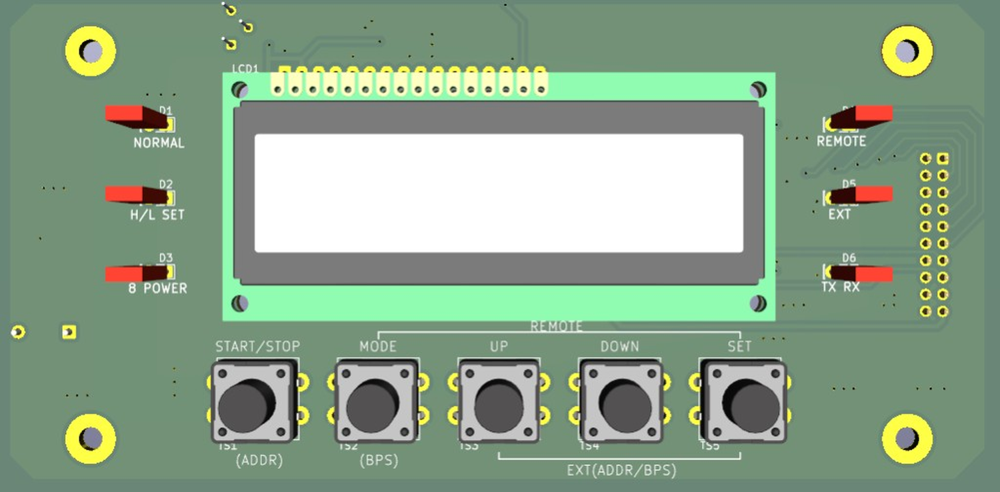
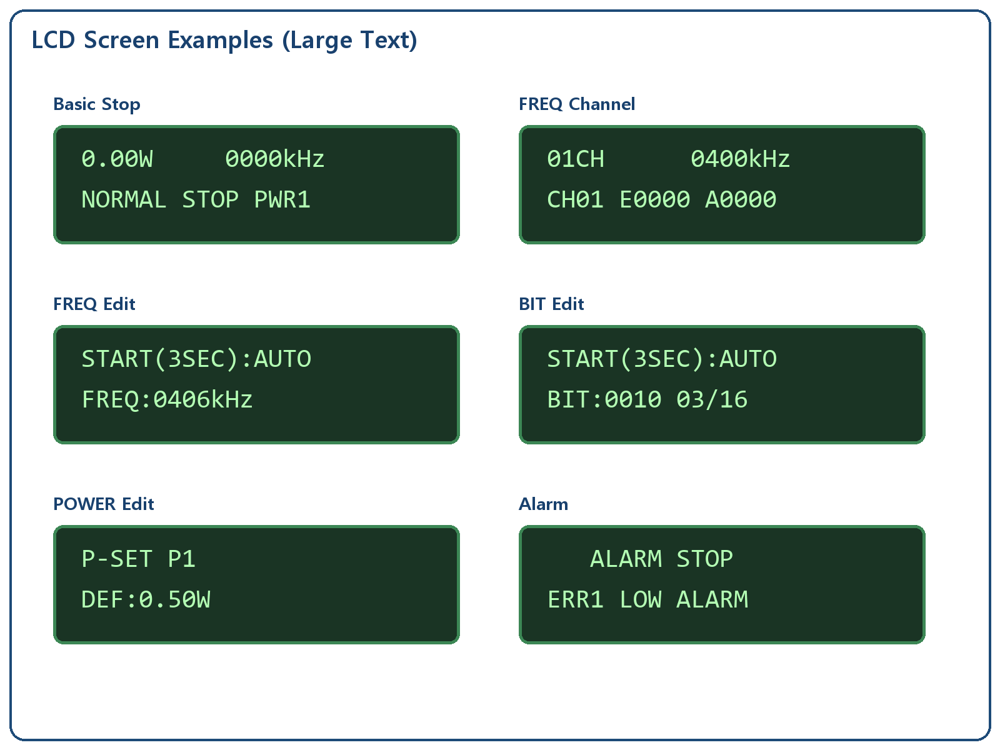
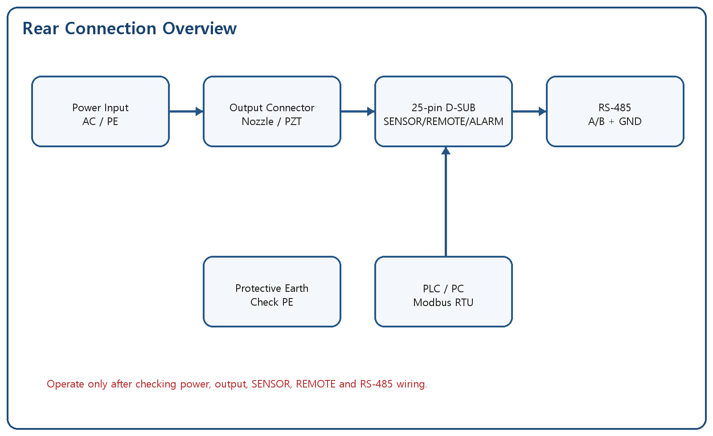
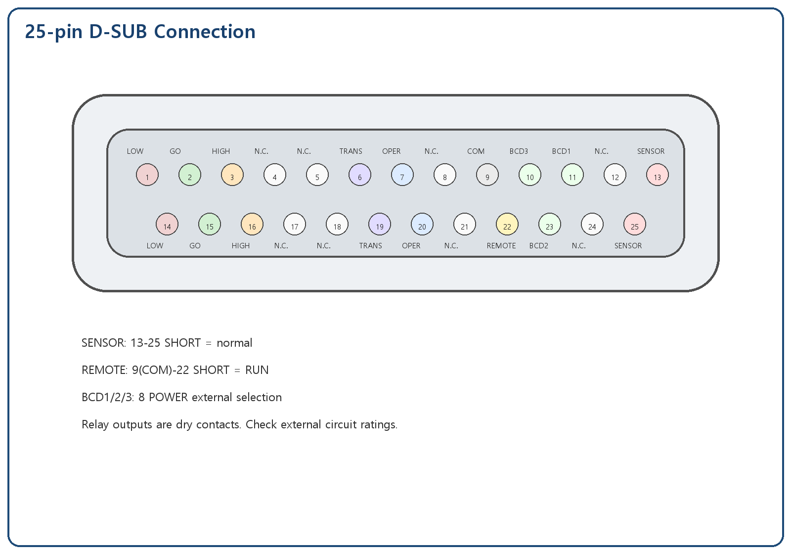
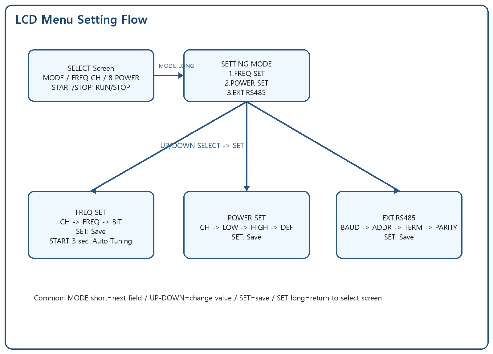

# CSF JET Multi Megasonic Generator

## LCD Panel User Operation Manual

- Document Version: v4.0-EN
- Revision Date: 2026-05-19
- Applicable Product: CSF JET Multi Megasonic Generator (LCD Panel Type)
- Purpose: This final user manual explains installation, wiring, LCD menu setup, NORMAL/REMOTE/EXT operation, alarm recovery, maintenance and service information.

---

## < OPERATING SUMMARY >

| Item | Operation |
| --- | --- |
| Run/Stop | Press START/STOP on the SELECT screen |
| Move item | Short press MODE: MODE -> FREQ CH -> 8 POWER |
| Enter setting | Long press MODE on the SELECT screen |
| Change value | UP/DOWN; long press repeats quickly |
| Save | Short press SET; two beeps indicate success |
| Return to select screen | Long press SET for about 2 seconds in setting screens |
| Auto Tuning | Long press START/STOP for about 3 seconds in FREQ SET |
| Clear alarm | Remove cause, then press SET on the alarm screen |

Buzzer guide: normal key 1 beep, long-press recognition 1 longer beep, save success 2 beeps, save failure 3 beeps, alarm 1 long beep.

## 1. Specification

| No. | Item | Specification |
| --- | --- | --- |
| 1 | Model name | CSF JET Multi Megasonic Generator |
| 2 | Display | LCD1602, 2 lines x 16 characters |
| 3 | Buttons | START/STOP, MODE, UP, DOWN, SET |
| 4 | Indicators | NORMAL, H/L SET, 8 POWER, REMOTE, EXT, TX/RX LEDs |
| 5 | Operating frequency | 10CH, 400kHz to 2200kHz |
| 6 | Frequency setting | Manual setting and Auto Tuning |
| 7 | LC BIT | 16 steps, BIT 0000 to 1111 |
| 8 | Output setting | 8 POWER profiles, LOW/HIGH/DEF |
| 9 | Output range | 0.20W to 5.00W |
| 10 | Control connector | 25-pin D-SUB |
| 11 | Communication | RS-485 Half-Duplex, Modbus RTU |
| 12 | Setting storage | Internal FLASH, retained after power-off |

## 2. Caution on Product Use

### 2.1 Caution on Installation

1. Install the generator on a stable support where vibration does not affect the unit.
2. Avoid acidic/alkaline gas, conductive dust, oil mist and high-temperature environments.
3. Secure ventilation space around the unit.
4. Connect protective earth before applying power.
5. Use the assigned nozzle/transducer and cable.
6. Do not change output cable type or length without confirmation.
7. Turn off power before wiring work.

### 2.2 Caution on Use

1. Do not operate while the output connector is disconnected.
2. If SENSOR is open, oscillation is inhibited or stopped.
3. Do not repeatedly restart after an alarm without checking the cause.
4. After installation or nozzle replacement, start at low output and increase gradually.
5. Keep sufficient interval between REMOTE ON and OFF.
6. For communication operation, match address, baudrate and parity with the master.

## 3. Name and Function of Each Part

### 3.1 Actual LCD Operation Panel



### 3.2 LCD Screen Examples



| Part | Function |
| --- | --- |
| LCD | Displays output, frequency, operation mode, setting menu and alarms |
| NORMAL LED | Indicates NORMAL operation mode |
| H/L SET LED | Indicates high/low alarm setting related status |
| 8 POWER LED | Indicates 8 POWER selection/setting |
| REMOTE LED | Indicates REMOTE mode |
| EXT LED | Indicates EXT communication mode |
| TX/RX LED | Indicates RS-485 transmit/receive activity |
| START/STOP | Starts/stops oscillation; long press in FREQ SET starts Auto Tuning |
| MODE | Moves selected item/edit field; long press enters setting or returns to upper menu |
| UP/DOWN | Increases/decreases values; long press repeats quickly |
| SET | Saves/confirms values; long press returns to SELECT screen in setting screens |

## 4. Connecting Method



Operate only after checking power, output, SENSOR, REMOTE, ALARM and RS-485 wiring.

### 4.1 25-pin D-SUB Control Connector



| Pin | Signal | Type | Description |
| --- | --- | --- | --- |
| 1 | LOW ALARM A | Relay contact | SHORT to pin 14 when Err1 occurs |
| 14 | LOW ALARM B | Relay contact | Err1 LOW ALARM |
| 2 | GO A | Relay contact | SHORT to pin 15 in normal output range |
| 15 | GO B | Relay contact | Normal output range |
| 3 | HIGH ALARM A | Relay contact | SHORT to pin 16 when Err2 occurs |
| 16 | HIGH ALARM B | Relay contact | Err2 HIGH ALARM |
| 6 | TRANSDUCER ALARM A | Relay contact | SHORT to pin 19 when Err5 occurs |
| 19 | TRANSDUCER ALARM B | Relay contact | Transducer/load alarm |
| 7 | OPERATE A | Fail-safe relay | SHORT to pin 20 in normal state; OPEN at alarm/power-off |
| 20 | OPERATE B | Fail-safe relay | Integrated operation/alarm contact |
| 9 | COM | Input common | Common for REMOTE/BCD inputs |
| 22 | REMOTE | Contact input | SHORT to pin 9 = RUN, OPEN = STOP |
| 11 | BCD1 | Contact input | 8 POWER external select bit1 |
| 23 | BCD2 | Contact input | 8 POWER external select bit2 |
| 10 | BCD3 | Contact input | 8 POWER external select bit3 |
| 13 | SENSOR A | Safety input | SHORT to pin 25 is normal |
| 25 | SENSOR B | Safety input | OPEN causes Err7/Err8 |
| 4,5,8,12,17,18,21,24 | N.C. | Reserved | Do not use |
| SHIELD | Connector shell | Shield | Connector body shield/ground |

### 4.2 REMOTE / SENSOR / ALARM Notes

- SENSOR is normally SHORT. OPEN causes Err7/Err8.
- During initial commissioning or service verification, if SENSOR wiring has not yet been connected, the SENSOR interlock may be temporarily held by service firmware setting.
- For shipment, the SENSOR interlock must be enabled. In NORMAL/REMOTE/EXT modes, RUN must be allowed only when SENSOR is in the normal SHORT state.
- If SENSOR opens during operation, output stops immediately and `Err8 SENSOR RUN` is displayed.
- REMOTE runs when COM and REMOTE input are SHORT, and stops when OPEN.
- Alarm outputs are dry relay contacts. Check external power/load rating.
- OPERATE is fail-safe: SHORT in normal state, OPEN at alarm or power-off.

### 4.3 8 POWER External Selection

| BCD3 | BCD2 | BCD1 | Selected POWER |
| --- | --- | --- | --- |
| 0 | 0 | 0 | PWR1 |
| 0 | 0 | 1 | PWR2 |
| 0 | 1 | 0 | PWR3 |
| 0 | 1 | 1 | PWR4 |
| 1 | 0 | 0 | PWR5 |
| 1 | 0 | 1 | PWR6 |
| 1 | 1 | 0 | PWR7 |
| 1 | 1 | 1 | PWR8 |

## 5. Operation Ready

1. Confirm DI water or process liquid is supplied to the nozzle when required.
2. Check output cable and 25-pin D-SUB wiring.
3. Confirm SENSOR is in normal SHORT state.
4. Turn on power and check LCD/LED indication.
5. Start the first operation at low output.

For shipment units, RUN is not allowed by START/STOP unless SENSOR is in the normal SHORT state. Even if the SENSOR interlock is temporarily held during initial commissioning or service verification, connect SENSOR wiring and confirm interlock operation before actual use.

## 6. Operating Method

### 6.1 Menu Structure



### 6.2 NORMAL Operation

1. Turn on power and check the NORMAL LED.
2. Select NORMAL in the MODE item and save with SET.
3. Select FREQ CH and 8 POWER.
4. Press START/STOP to start oscillation.
5. Check RUN indication and output value on the LCD.
6. Press START/STOP again to stop.

### 6.3 FREQ Channel Selection

| Channel | Default Frequency | Description |
| --- | --- | --- |
| CH01 | 400kHz | Frequency profile 1 |
| CH02 | 600kHz | Frequency profile 2 |
| CH03 | 800kHz | Frequency profile 3 |
| CH04 | 1000kHz | Frequency profile 4 |
| CH05 | 1200kHz | Frequency profile 5 |
| CH06 | 1400kHz | Frequency profile 6 |
| CH07 | 1600kHz | Frequency profile 7 |
| CH08 | 1800kHz | Frequency profile 8 |
| CH09 | 2000kHz | Frequency profile 9 |
| CH10 | 2200kHz | Frequency profile 10 |

On the SELECT screen, use MODE to select FREQ CH, choose a channel with UP/DOWN, then press SET.

### 6.4 FREQ SET: Manual Frequency/BIT Setting

1. Long press MODE to enter SETTING MODE.
2. Select 1.FREQ SET and press SET.
3. Short press MODE to move CH -> FREQ -> BIT fields.
4. Change the blinking value with UP/DOWN.
5. Press SET to save the frequency and BIT of the current channel.
6. Two beeps indicate successful save.

BIT is the LC relay combination, 16 steps from 0000 to 1111. E is the saved expected BIT; A is the currently applied actual BIT.

### 6.5 Auto Tuning

1. Select the target channel in FREQ SET.
2. Press START/STOP for about 3 seconds.
3. The LCD shows tuning progress.
4. When AUTO TUNE DONE appears, save with SET if needed.
5. If NO DETECTED or TUNE TIMEOUT appears, check nozzle/cable/load.

### 6.6 POWER SET

| Field | Meaning | Range |
| --- | --- | --- |
| CH | POWER profile number | PWR1~PWR8 |
| LOW | Low alarm threshold | 0.10W~0.95W |
| HIGH | High alarm threshold | 0.20W~5.00W |
| DEF | Default output | 0.20W~5.00W |

Long press MODE -> 2.POWER SET -> SET -> use MODE to move CH/LOW/HIGH/DEF -> change with UP/DOWN -> save with SET.

### 6.7 REMOTE Operation

1. Stop oscillation and turn off power.
2. Wire the REMOTE contact on the 25-pin D-SUB.
3. Turn on power, select REMOTE in MODE item and save with SET.
4. REMOTE SHORT means RUN; OPEN means STOP.

### 6.8 EXT Operation

1. Select EXT in MODE item and save with SET.
2. Enter SETTING MODE -> 3.EXT:RS485.
3. Set BAUD, ADDR, TERM and PARITY.
4. Connect from the master using the same communication settings.

| Field | Setting | Description |
| --- | --- | --- |
| BAUD | 9600/19200/38400/115200 | Communication speed |
| ADDR | 1~247 | Slave address |
| TERM | OFF/ON | Termination setting record; hardware control reserved |
| PARITY | NONE-8-1/EVEN-8-1 | Panel parity setting |

## 7. ERROR Display

```text
   ALARM STOP
ERR1 LOW ALARM
```

| Code | Contents | Condition | Output | Action |
| --- | --- | --- | --- | --- |
| Err1 | LOW ALARM | Output remains below LOW setting | Stop | Check load/cable/LOW setting, then press SET |
| Err2 | HIGH ALARM | Output remains above HIGH setting | Stop | Check output setting/load/HIGH setting, then press SET |
| Err5 | TRANSDUCER ALARM | Transducer or load abnormal | Stop | Check nozzle/transducer/cable |
| Err6 | SETTING ERROR | Setting outside allowed range | Conditional | Enter a value within the allowed range |
| Err7 | SENSOR OFF | SENSOR open while stopped | Output inhibited | Power OFF -> check SENSOR short -> power ON |
| Err8 | SENSOR RUN | SENSOR open while running | Stop | Power OFF -> check SENSOR short -> power ON |

Alarm reset procedure:

1. When `ALARM STOP` is displayed, confirm that output has stopped.
2. Check the alarm cause such as load, cable, SENSOR, or LOW/HIGH setting.
3. After removing the cause, briefly press `SET` to clear the alarm display.
4. If the same alarm repeats, do not restart repeatedly. Check output settings and wiring again.

If `LOW ALARM` repeats during initial commissioning, the actual output voltage/current feedback may not yet be stable. In this case, lower the LOW setting or temporarily hold the LOW alarm in service verification mode, then first confirm that `ADC2_IN3` current and `ADC2_IN4` voltage increase normally.

## 8. Communication Specification

| Item | Specification |
| --- | --- |
| Interface | RS-485 Half-Duplex |
| Protocol | Modbus RTU |
| Default setting | ADDR 1, 9600bps, NONE-8-1 |
| Supported baudrates | 9600/19200/38400/115200 |
| Setting menu | SETTING MODE -> 3.EXT:RS485 |
| Function codes | 0x03 / 0x06 / 0x10 |

| Address | R/W | Name | Value |
| --- | --- | --- | --- |
| 0x0000 | R/W | RUN control | 0=STOP, 1=RUN |
| 0x0001 | R/W | Frequency | x0.1kHz |
| 0x0002 | R/W | Duty | x0.1% |
| 0x0006 | R/W | Operation mode | 0=NORMAL,1=REMOTE,2=EXT |
| 0x0010 | R/W | Slave address | 1~247 |
| 0x0011 | R/W | Baud index | 0~3 |
| 0x0012 | R/W | Parity | 0=None,1=Even,2=Odd |

## 9. Initial Setting Value

| Item | Initial Value |
| --- | --- |
| MODE | NORMAL |
| FREQ CH | CH01 / 400kHz |
| POWER | PWR1 / DEF 0.50W |
| LOW ALARM | 0.10W |
| HIGH ALARM | 5.00W |
| RS-485 | ADDR1 / 9600bps / NONE-8-1 |

## 10. Setting Storage

Operating mode, FREQ channel/frequency/BIT, POWER channel/LOW/HIGH/DEF, and RS-485 settings saved by SET are stored in internal FLASH and retained after power-off.

## 11. Troubleshooting

| Symptom | Possible Cause | Action |
| --- | --- | --- |
| No output | STOP/alarm/SENSOR open | Check LCD, alarm and SENSOR |
| Err7 at power ON | SENSOR OPEN | Power OFF and check pin 13-25 SHORT |
| REMOTE does not work | Pin 9-22 contact or mode setting error | Check REMOTE wiring and mode |
| No RS-485 response | A/B, address, baudrate or parity mismatch | Check EXT:RS485 setting |
| Saved value not restored | SET not pressed or save failed | Save again and confirm two beeps |

## 12. Maintenance

- Daily: check cables/connectors, LCD/LEDs and alarm history
- Weekly: check output repeatability, REMOTE contact and RS-485 response
- Monthly: check transducer/cable insulation, alarm thresholds and setting backup

## 13. A/S

When requesting service, provide model name, serial number, alarm code, operating condition, installation photos and reproduction steps. Unauthorized modification, incorrect wiring, natural disasters and consumables may be excluded from warranty.

## 14. Revision History

| Version | Date | Description |
| --- | --- | --- |
| v4.0-EN | 2026-05-19 | LCD panel full user manual with 25-pin D-SUB, actual panel image, detailed menu settings, REMOTE/EXT operation and bilingual output |
