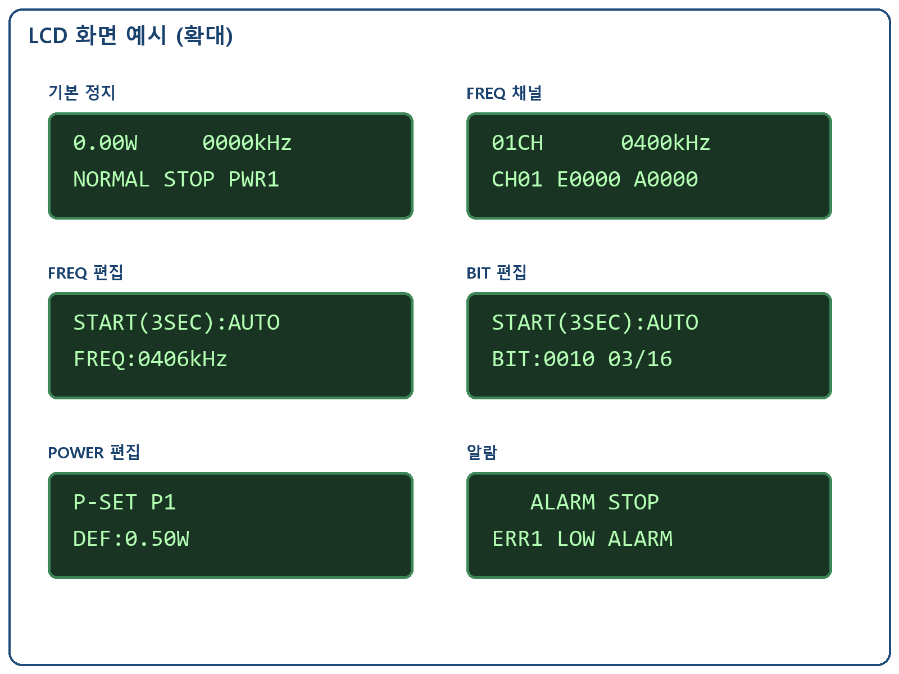
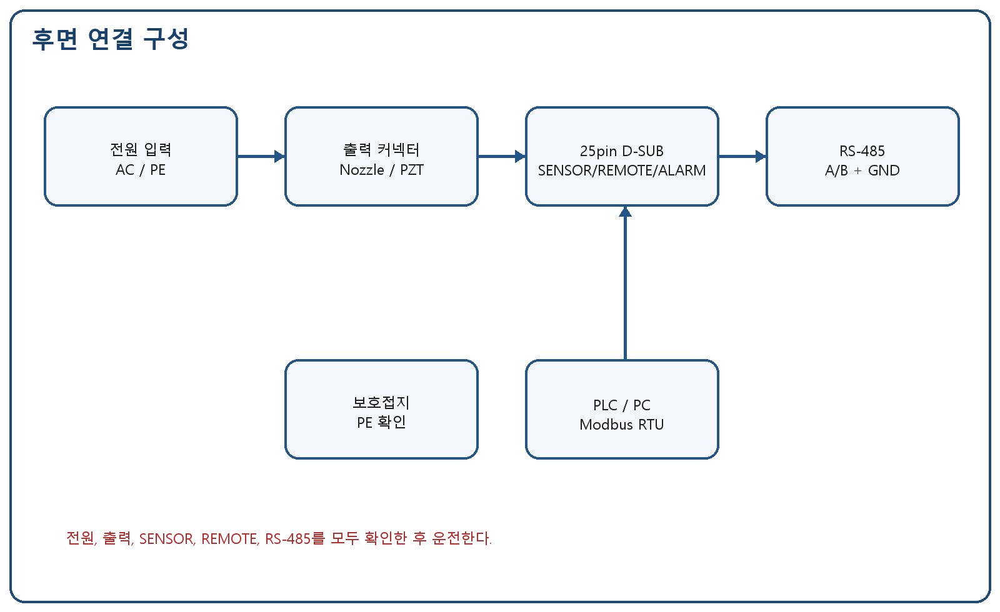
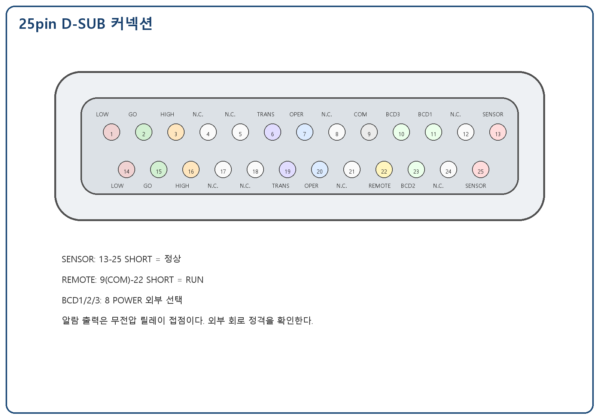
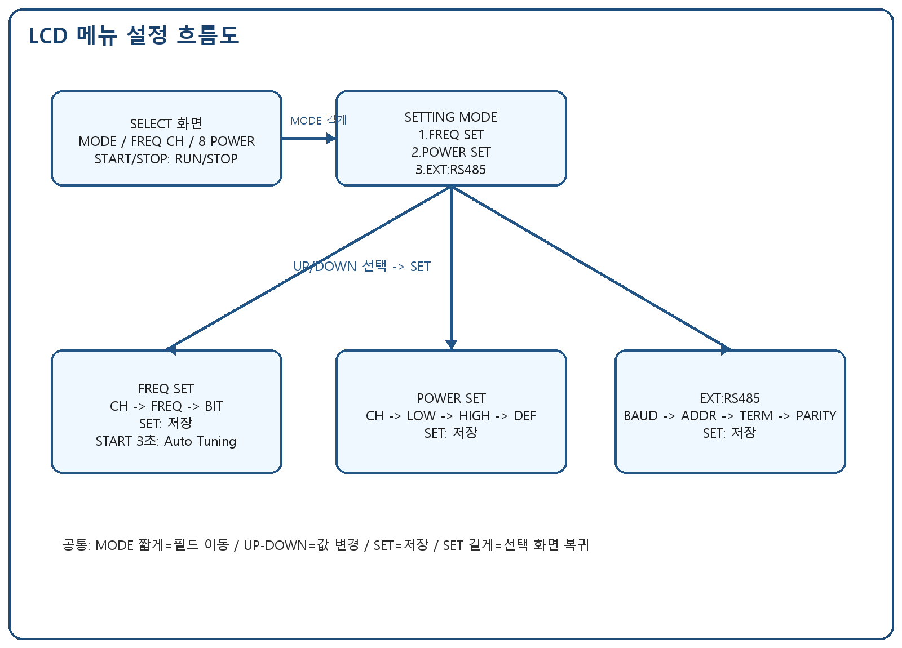

# CSF JET Multi Megasonic Generator

## LCD 패널 사용자 운전 매뉴얼

- 문서 버전: v4.0-KR
- 개정일: 2026-05-26
- 적용 장비: CSF JET Multi Megasonic Generator (LCD Panel Type)
- 목적: 본 매뉴얼은 사용자가 장비 설치, 배선, LCD 메뉴 설정, NORMAL/REMOTE/EXT 운전, 알람 조치, 유지보수를 수행할 수 있도록 작성한 최종 사용자 문서이다.

---

## < OPERATING SUMMARY >

| 항목 | 조작 |
| --- | --- |
| 발진 시작/정지 | SELECT 화면에서 START/STOP |
| 항목 이동 | MODE 짧게: MODE -> FREQ CH -> 8 POWER |
| 설정 진입 | SELECT 화면에서 MODE 길게 |
| 값 변경 | UP/DOWN, 길게 누르면 빠른 반복 |
| 저장 | SET 짧게, 성공 시 비프 2회 |
| 선택 화면 복귀 | 설정 화면에서 SET 약 2초 |
| Auto Tuning | FREQ SET에서 START/STOP 약 3초 |
| 알람 해제 | 원인 제거 후 알람 화면에서 SET |

비프음: 일반 버튼 1회, 길게 누름 인식 긴 1회, 저장 성공 2회, 저장 실패 3회, 알람 긴 1회.

## 1. Specification

| No. | 항목 | 사양 |
| --- | --- | --- |
| 1 | 모델명 | CSF JET Multi Megasonic Generator |
| 2 | 표시 장치 | LCD1602, 2행 x 16문자 |
| 3 | 버튼 | START/STOP, MODE, UP, DOWN, SET |
| 4 | 상태 표시 | NORMAL, H/L SET, 8 POWER, REMOTE, EXT, TX/RX LED |
| 5 | 동작 주파수 | 10CH, 400kHz ~ 2200kHz |
| 6 | 주파수 설정 | 수동 설정 및 Auto Tuning |
| 7 | LC BIT | 16단계, BIT 0000 ~ 1111 |
| 8 | 출력 설정 | 8 POWER 프로파일, LOW/HIGH/DEF |
| 9 | 출력 범위 | 0.30W ~ 2.50W |
| 10 | 제어 커넥터 | 25pin D-SUB |
| 11 | 통신 | RS-485 Half-Duplex, Modbus RTU |
| 12 | 설정 저장 | 내부 FLASH 저장, 전원 OFF 후 유지 |

## 2. Caution on Product Use

### 2.1 설치 주의사항

1. 진동 영향을 받지 않는 안정된 위치에 설치한다.
2. 산성/알칼리성 가스, 전도성 먼지, 유증기, 고온 환경을 피한다.
3. 방열을 위해 전후좌우 통풍 공간을 확보한다.
4. 보호접지(PE)를 먼저 연결한 후 전원을 인가한다.
5. 지정된 노즐/트랜스듀서와 케이블을 사용한다.
6. 출력 케이블 종류나 길이를 임의로 변경하지 않는다.
7. 배선 작업 전 반드시 전원을 끈다.

### 2.2 사용 주의사항

1. 출력 커넥터가 빠진 상태에서 운전하지 않는다.
2. SENSOR가 OPEN이면 발진이 금지되거나 정지된다.
3. 알람 발생 후 원인 확인 없이 반복 재기동하지 않는다.
4. 설치 또는 노즐 교체 후에는 낮은 출력부터 단계적으로 운전한다.
5. REMOTE ON/OFF는 충분한 간격을 두고 수행한다.
6. 통신 운전 시 주소, 속도, 패리티를 마스터와 일치시킨다.

## 3. Name and Function of Each Part

### 3.1 실제 LCD 조작 패널


### 3.2 LCD 화면 예시



| 부품 | 기능 |
| --- | --- |
| LCD | 출력, 주파수, 운전 모드, 설정 메뉴, 알람 표시 |
| NORMAL LED | NORMAL 운전 모드 표시 |
| H/L SET LED | 알람 상/하한 설정 관련 표시 |
| 8 POWER LED | 8 POWER 선택/설정 표시 |
| REMOTE LED | REMOTE 모드 표시 |
| EXT LED | EXT 통신 모드 표시 |
| TX/RX LED | RS-485 송수신 상태 표시 |
| START/STOP | 발진 시작/정지, FREQ SET에서 길게 누르면 Auto Tuning |
| MODE | 선택 항목/편집 필드 이동, 길게 누르면 설정 진입 또는 상위 복귀 |
| UP/DOWN | 값 증가/감소, 길게 누르면 빠른 반복 |
| SET | 저장/확정, 설정 화면에서 길게 누르면 SELECT 화면 복귀 |

## 4. Connecting Method



전원, 출력, SENSOR, REMOTE, ALARM, RS-485를 모두 확인한 후 운전한다.

### 4.1 25pin D-SUB Control Connector



| 핀 | 신호 | 구분 | 설명 |
| --- | --- | --- | --- |
| 1 | LOW ALARM A | 릴레이 접점 | Err1 발생 시 14번과 SHORT |
| 14 | LOW ALARM B | 릴레이 접점 | Err1 LOW ALARM |
| 2 | GO A | 릴레이 접점 | 정상 출력 범위에서 15번과 SHORT |
| 15 | GO B | 릴레이 접점 | 정상 출력 범위 |
| 3 | HIGH ALARM A | 릴레이 접점 | Err2 발생 시 16번과 SHORT |
| 16 | HIGH ALARM B | 릴레이 접점 | Err2 HIGH ALARM |
| 6 | TRANSDUCER ALARM A | 릴레이 접점 | Err5 발생 시 19번과 SHORT |
| 19 | TRANSDUCER ALARM B | 릴레이 접점 | 진동자/부하 이상 |
| 7 | OPERATE A | Fail-safe 릴레이 | 정상 시 20번과 SHORT, 알람/전원 OFF 시 OPEN |
| 20 | OPERATE B | Fail-safe 릴레이 | 통합 운전/알람 접점 |
| 9 | COM | 입력 공통 | REMOTE/BCD 입력 공통 |
| 22 | REMOTE | 접점 입력 | 9번과 SHORT 시 RUN, OPEN 시 STOP |
| 11 | BCD1 | 접점 입력 | 8 POWER 외부 선택 bit1 |
| 23 | BCD2 | 접점 입력 | 8 POWER 외부 선택 bit2 |
| 10 | BCD3 | 접점 입력 | 8 POWER 외부 선택 bit3 |
| 13 | SENSOR A | 안전 입력 | 25번과 SHORT 정상 |
| 25 | SENSOR B | 안전 입력 | OPEN 시 Err7/Err8 |
| 4,5,8,12,17,18,21,24 | N.C. | 예약 | 사용하지 않음 |
| SHIELD | Connector shell | 쉴드 | 커넥터 바디 접지/쉴드 |

### 4.2 REMOTE / SENSOR / ALARM 주의사항

- SENSOR는 정상 상태에서 SHORT이며 OPEN 시 Err7/Err8이 발생한다.
- 초기 시운전 또는 서비스 점검 중 SENSOR 배선이 아직 연결되지 않은 경우에는 점검용 펌웨어 설정에서 SENSOR 인터록을 임시 보류할 수 있다.
- 출고용 장비는 반드시 SENSOR 인터록을 활성화해야 하며, NORMAL/REMOTE/EXT 모든 모드에서 SENSOR가 정상 SHORT 상태일 때만 RUN이 가능해야 한다.
- 운전 중 SENSOR가 OPEN되면 출력은 즉시 정지되고 `Err8 SENSOR RUN`이 표시된다.
- REMOTE는 COM과 REMOTE 입력이 SHORT이면 RUN, OPEN이면 STOP이다.
- 알람 출력은 무전압 릴레이 접점이므로 외부 전원/부하 정격을 확인한다.
- OPERATE는 Fail-safe 접점으로 정상 시 SHORT, 알람 또는 전원 OFF 시 OPEN이다.

### 4.3 8 POWER 외부 선택

| BCD3 | BCD2 | BCD1 | 선택 POWER |
| --- | --- | --- | --- |
| 0 | 0 | 0 | PWR1 |
| 0 | 0 | 1 | PWR2 |
| 0 | 1 | 0 | PWR3 |
| 0 | 1 | 1 | PWR4 |
| 1 | 0 | 0 | PWR5 |
| 1 | 0 | 1 | PWR6 |
| 1 | 1 | 0 | PWR7 |
| 1 | 1 | 1 | PWR8 |

## 5. Operation Ready

1. 공정 조건에 따라 노즐에 DI water 또는 액체가 공급되는지 확인한다.
2. 출력 케이블과 25pin D-SUB 배선을 확인한다.
3. SENSOR가 정상 SHORT 상태인지 확인한다.
4. 전원 ON 후 LCD와 LED 표시를 확인한다.
5. 낮은 출력으로 최초 운전을 시작한다.

출고용 장비에서는 SENSOR가 정상 SHORT 상태가 아니면 START/STOP을 눌러도 RUN이 허용되지 않는다. 초기 시운전 또는 서비스 점검 중 SENSOR 인터록을 임시 보류한 경우에도, 실제 사용 전에는 SENSOR 배선을 연결하고 인터록 동작을 반드시 확인한다.

## 6. Operating Method

### 6.1 메뉴 구조



### 6.2 NORMAL 운전

1. 전원 ON 후 NORMAL LED를 확인한다.
2. MODE 항목에서 NORMAL을 선택하고 SET 저장한다.
3. FREQ CH와 8 POWER를 선택한다.
4. START/STOP을 눌러 발진을 시작한다.
5. LCD의 RUN 표시와 출력값을 확인한다.
6. 정지하려면 START/STOP을 다시 누른다.

### 6.3 FREQ 채널 선택

| 채널 | 기본 주파수 | 설명 |
| --- | --- | --- |
| CH01 | 400kHz | 주파수 프로파일 1 |
| CH02 | 600kHz | 주파수 프로파일 2 |
| CH03 | 800kHz | 주파수 프로파일 3 |
| CH04 | 1000kHz | 주파수 프로파일 4 |
| CH05 | 1200kHz | 주파수 프로파일 5 |
| CH06 | 1400kHz | 주파수 프로파일 6 |
| CH07 | 1600kHz | 주파수 프로파일 7 |
| CH08 | 1800kHz | 주파수 프로파일 8 |
| CH09 | 2000kHz | 주파수 프로파일 9 |
| CH10 | 2200kHz | 주파수 프로파일 10 |

SELECT 화면에서 MODE로 FREQ CH 항목을 선택하고 UP/DOWN으로 채널을 고른 뒤 SET을 누른다.

### 6.4 FREQ SET: 수동 주파수/BIT 설정

1. MODE 길게 -> SETTING MODE 진입.
2. 1.FREQ SET 선택 후 SET.
3. MODE 짧게로 CH -> FREQ -> BIT 필드를 이동한다.
4. 깜빡이는 값은 UP/DOWN으로 변경한다.
5. SET을 눌러 현재 CH의 주파수와 BIT를 저장한다.
6. 저장 성공 시 비프음이 2회 울린다.

BIT는 LC 릴레이 조합이며 0000~1111의 16단계이다. E는 저장된 기대 BIT, A는 현재 실제 적용 BIT이다.

#### 6.4.1 LC BIT 16개 조합

LC BIT는 4개의 릴레이 ON/OFF 조합이다. bit0은 `LC_RELAY1`, bit1은 `LC_RELAY2`, bit2는 `LC_RELAY3`, bit3은 `LC_RELAY4`를 의미한다.

| LC BIT | LC_RELAY4 bit3 | LC_RELAY3 bit2 | LC_RELAY2 bit1 | LC_RELAY1 bit0 | 계산 L값 |
| --- | --- | --- | --- | --- | --- |
| 0000 | OFF | OFF | OFF | OFF | 1.94uH |
| 0001 | OFF | OFF | OFF | ON | 2.63uH |
| 0010 | OFF | OFF | ON | OFF | 4.14uH |
| 0011 | OFF | OFF | ON | ON | 4.83uH |
| 0100 | OFF | ON | OFF | OFF | 6.64uH |
| 0101 | OFF | ON | OFF | ON | 7.33uH |
| 0110 | OFF | ON | ON | OFF | 8.84uH |
| 0111 | OFF | ON | ON | ON | 9.53uH |
| 1000 | ON | OFF | OFF | OFF | 8.74uH |
| 1001 | ON | OFF | OFF | ON | 9.43uH |
| 1010 | ON | OFF | ON | OFF | 10.94uH |
| 1011 | ON | OFF | ON | ON | 11.63uH |
| 1100 | ON | ON | OFF | OFF | 13.44uH |
| 1101 | ON | ON | OFF | ON | 14.13uH |
| 1110 | ON | ON | ON | OFF | 15.64uH |
| 1111 | ON | ON | ON | ON | 16.33uH |

기본 부품값 기준은 고정 L=1.94uH, `LC_RELAY1`=0.69uH, `LC_RELAY2`=2.20uH, `LC_RELAY3`=4.70uH, `LC_RELAY4`=6.80uH이다. 펌웨어 기본값은 CH04(1MHz)=1111, CH09(2MHz)=0001, 그 외 채널=0000이다.

### 6.5 Auto Tuning

1. FREQ SET에서 대상 CH를 선택한다.
2. START/STOP을 약 3초 누른다.
3. LCD에 튜닝 진행 상태가 표시된다.
4. AUTO TUNE DONE 표시 후 필요한 경우 SET 저장한다.
5. NO DETECTED 또는 TUNE TIMEOUT이면 노즐/케이블/부하를 점검한다.

### 6.6 POWER SET

| 필드 | 의미 | 범위 |
| --- | --- | --- |
| CH | POWER 프로파일 번호 | PWR1~PWR8 |
| LOW | 저출력 알람 기준 | 0.30W~2.50W |
| HIGH | 고출력 알람 기준 | 0.30W~2.50W |
| DEF | 기본 출력 | 0.30W~2.50W |

MODE 길게 -> 2.POWER SET -> SET -> MODE로 CH/LOW/HIGH/DEF 이동 -> UP/DOWN 변경 -> SET 저장.

#### 6.6.1 8POWER 기본값

현재 기본값은 LOW=0.30W, HIGH=2.50W로 공통 적용되고, DEF는 PWR1부터 0.25W 간격으로 증가한다.

| POWER | LOW 기본값 | DEF 기본값 | HIGH 기본값 |
| --- | --- | --- | --- |
| PWR1 | 0.30W | 0.50W | 2.50W |
| PWR2 | 0.30W | 0.75W | 2.50W |
| PWR3 | 0.30W | 1.00W | 2.50W |
| PWR4 | 0.30W | 1.25W | 2.50W |
| PWR5 | 0.30W | 1.50W | 2.50W |
| PWR6 | 0.30W | 1.75W | 2.50W |
| PWR7 | 0.30W | 2.00W | 2.50W |
| PWR8 | 0.30W | 2.25W | 2.50W |

### 6.7 REMOTE 운전

1. 발진을 정지하고 전원을 끈다.
2. 25pin D-SUB의 REMOTE 접점을 배선한다.
3. 전원 ON 후 MODE 항목에서 REMOTE를 선택하고 SET 저장한다.
4. REMOTE 접점 SHORT 시 RUN, OPEN 시 STOP으로 동작한다.

### 6.8 EXT 운전

1. MODE 항목에서 EXT를 선택하고 SET 저장한다.
2. SETTING MODE -> 3.EXT:RS485로 진입한다.
3. BAUD, ADDR, TERM, PARITY를 설정한다.
4. 마스터 장비에서 동일한 통신 조건으로 접속한다.

| 필드 | 설정값 | 설명 |
| --- | --- | --- |
| BAUD | 9600/19200/38400/115200 | 통신 속도 |
| ADDR | 1~247 | 슬레이브 주소 |
| TERM | OFF/ON | 종단 설정 기록, 하드웨어 제어 예약 |
| PARITY | NONE-8-1/EVEN-8-1 | 패널 설정 패리티 |

## 7. ERROR Display

```text
   ALARM STOP
ERR1 LOW ALARM
```

| 코드 | 내용 | 발생 조건 | 출력 | 조치 |
| --- | --- | --- | --- | --- |
| Err1 | LOW ALARM | 출력이 LOW 설정값보다 낮은 상태 지속 | 출력 정지 | 부하/케이블/LOW 설정 확인 후 SET |
| Err2 | HIGH ALARM | 출력이 HIGH 설정값보다 높은 상태 지속 | 출력 정지 | 출력 설정/부하/HIGH 설정 확인 후 SET |
| Err5 | TRANSDUCER ALARM | 진동자 또는 부하 이상 | 출력 정지 | 노즐/트랜스듀서/케이블 확인 |
| Err6 | SETTING ERROR | 허용 범위 밖 설정 | 조건부 | 허용 범위로 재입력 |
| Err7 | SENSOR OFF | 정지 중 SENSOR OPEN | 출력 금지 | 전원 OFF -> SENSOR SHORT 확인 -> 전원 ON |
| Err8 | SENSOR RUN | 운전 중 SENSOR OPEN | 출력 정지 | 전원 OFF -> SENSOR SHORT 확인 -> 전원 ON |

알람 해제 절차:

1. LCD에 `ALARM STOP`이 표시되면 출력이 정지된 상태인지 확인한다.
2. 알람 원인(부하, 케이블, SENSOR, LOW/HIGH 설정값)을 확인한다.
3. 원인을 제거한 뒤 `SET` 버튼을 짧게 눌러 알람 표시를 해제한다.
4. 동일 알람이 반복되면 즉시 재운전하지 말고 출력 설정과 배선을 다시 점검한다.

초기 시운전 중 `LOW ALARM`이 반복될 경우, 실제 출력 전압/전류 피드백이 안정되기 전일 수 있다. 이때는 LOW 설정값을 낮게 조정하거나 서비스 점검 모드에서 LOW 알람을 임시 보류한 뒤 `ADC2_IN3` 전류값과 `ADC2_IN4` 전압값이 정상적으로 증가하는지 먼저 확인한다.

## 8. Communication Specification

| 항목 | 사양 |
| --- | --- |
| 인터페이스 | RS-485 Half-Duplex |
| 프로토콜 | Modbus RTU |
| 기본 설정 | ADDR 1, 9600bps, NONE-8-1 |
| 지원 속도 | 9600/19200/38400/115200 |
| 설정 메뉴 | SETTING MODE -> 3.EXT:RS485 |
| 기능 코드 | 0x03 / 0x06 / 0x10 |

| 주소 | R/W | 명칭 | 값 |
| --- | --- | --- | --- |
| 0x0000 | R/W | RUN 제어 | 0=STOP, 1=RUN |
| 0x0001 | R/W | 주파수 | x0.1kHz |
| 0x0002 | R/W | Duty | x0.1% |
| 0x0006 | R/W | 운전 모드 | 0=NORMAL,1=REMOTE,2=EXT |
| 0x0010 | R/W | 슬레이브 주소 | 1~247 |
| 0x0011 | R/W | Baud 인덱스 | 0~3 |
| 0x0012 | R/W | Parity | 0=None,1=Even,2=Odd |

## 9. Initial Setting Value

| 항목 | 초기값 |
| --- | --- |
| MODE | NORMAL |
| FREQ CH | CH01 / 400kHz |
| POWER | PWR1 / DEF 0.50W |
| LOW ALARM | 0.30W |
| HIGH ALARM | 2.50W |
| RS-485 | ADDR1 / 9600bps / NONE-8-1 |

## 10. Setting Storage

SET으로 저장한 운전 모드, FREQ 채널/주파수/BIT, POWER 채널/LOW/HIGH/DEF, RS-485 설정은 내부 FLASH에 저장되어 전원 OFF 후에도 유지된다.

## 11. Troubleshooting

| 증상 | 원인 후보 | 조치 |
| --- | --- | --- |
| 출력 없음 | STOP/알람/SENSOR OPEN | LCD와 알람, SENSOR 확인 |
| 전원 ON 시 Err7 | SENSOR OPEN | 전원 OFF 후 13-25 SHORT 확인 |
| REMOTE 동작 안 됨 | 9-22 접점/모드 설정 오류 | REMOTE 배선과 모드 확인 |
| RS-485 응답 없음 | A/B, 주소, 속도, 패리티 불일치 | EXT:RS485 설정 확인 |
| 저장값 미복원 | SET 미저장 또는 저장 실패 | SET 후 비프 2회 확인 |

## 12. Maintenance

- 일일: 케이블/커넥터, LCD/LED, 알람 이력 확인
- 주간: 출력 재현성, REMOTE 접점, RS-485 응답 확인
- 월간: 트랜스듀서/케이블 절연, 알람 기준, 중요 설정 백업

## 13. A/S

서비스 요청 시 모델명, 시리얼 번호, 알람 코드, 발생 조건, 설치 사진, 재현 절차를 함께 제공한다. 임의 개조, 오배선, 자연재해, 소모품은 보증 범위에서 제외될 수 있다.

## 14. Revision History

| Version | Date | Description |
| --- | --- | --- |
| v4.1-KR | 2026-05-26 | Added 8POWER default table and LC BIT 16-combination table |
| v4.0-KR | 2026-05-19 | LCD panel full user manual with 25-pin D-SUB, actual panel image, detailed menu settings, REMOTE/EXT operation and bilingual output |
