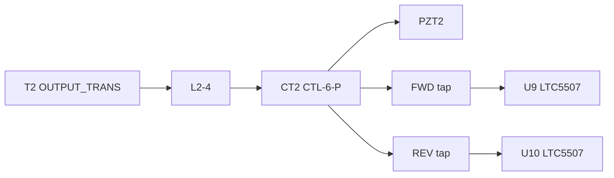

# PZT_OUTPUT_DETECT_LTC5507.jpg 회로도 적절성 검토

## 결론 요약

- **고주파 전력 검출 전체 블록(출력 변압기 → 라인에 CT2 직렬 → PZT 부하, 커플러에서 순/역 전력 분리 → 별도 검출기)** 방향은 일반적인 설계 흐름과 맞습니다.
- 다만 **LTC5507(U9, U10) 주변은 데이터시트 “Typical Application”과 다르게 그려진 부분**이 있어, “제대로 그려졌다”고 보기 어렵고 **최소한 PCAP·SHDN은 데이터시트 기준으로 재검토**하는 것이 좋습니다.

---

## 1. LTC5507 — 가장 중요한 점: PCAP(Pin 5)와 RFIN(Pin 6)

[Analog Devices LTC5507](https://www.analog.com/en/products/ltc5507.html) 데이터시트에 따르면:

- **Pin 6 (RFIN)**: RF 입력 (AC 커플링 캐패시터로 인가하는 것이 전형).
- **Pin 5 (PCAP)**: 피크 검출기에 연결되는 **외부 캐패시터 단자**로, 대역/응답을 맞추기 위해 **VCC 쪽과의 조합**으로 사용하는 구성이 데이터시트 전형 응용에 나옵니다.

해당 JPG 상에서는 **PCAP이 RFIN과 동일 노드로 묶여 있는 것으로 보이는데**, 이는 데이터시트의 기본 권장 연결과 맞지 않습니다. 의도된 값이 아니라면 **회로도 오류(넷 라벨/배선)** 가능성이 큽니다.

**권장**: 데이터시트 Figure “Typical Application”에 맞춰 **C_RF(인가) + PCAP–VCC 간 C_peak** 등으로 다시 그리고, 동작 주파수에 맞춰 C 값을 선정하는 것이 안전합니다.

---

## 2. /SHDN (Pin 1)

데이터시트상 **SHDN은 임계 전압으로 동작/셧다운을 구분**합니다. **부동(floating)**이면 공정/노이즈에 따라 비활성으로 들어갈 수 있어 **항상 동작**이 목표면 **VCC로 풀업**하거나 **직접 VCC 연결** 등으로 명확히 “활성” 상태를 주는 편이 맞습니다.

---

## 3. 커플러·종단 네트워크 (CT2, C14/C15, R17/R19, R21–R26)

- **CTL-6-P**류 방향성 커플러와 **라인 양단 전압 샘플(10pF+50Ω)** 조합은 **순방향/역방향 분리** 목적에 쓰이는 형태로 이해할 수 있습니다.
- 다만 **실제 주파수·임피던스·커플링량**에 따라 **50Ω 종단과 25Ω 병렬 등 저항 값**이 맞는지는 **Mini-Circuits 해당 부품 데이터시트 + 시뮬레이션/측정** 없이는 “도면상 완전 검증”이 어렵습니다.

즉, **블록 수준은 타당**, **부품 값·배선은 주파수 대역 검증 필요**입니다.

---

## 4. LTC5507 입력 레벨

데이터시트에서 **RFIN 허용 입력 전력 범위(대략 -34 dBm ~ +14 dBm 수준)**가 제한됩니다. 커플러 FWD/REV 탭이 이 범위를 넘지 않도록 **감쇠/커플링 설계**가 되어 있는지 확인이 필요합니다 (도면만으로는 전력 레벨 판단 불가).

---

## 5. 참고: 동일 폴더의 다른 파일

[`PZT_OUTPUT_DETECT.jpg`](d:/01_AllData/06_Embedded_Proj/STM32_Cop/ms_main_board_st/docs/PZT_OUTPUT_DETECT.jpg)는 파일명과 달리 **이산 다이오드 검파** 쪽에 가깝게 보이는 별도 도면일 수 있어, **LTC5507 버전과 혼동하지 않는 것**이 좋습니다.

---

---

## 정리

| 항목                   | 평가                                                  |
| ---------------------- | ----------------------------------------------------- |
| 방향성 검출 전체 구조  | 개념적으로 타당                                       |
| LTC5507 PCAP 연결      | 데이터시트 전형과 불일치 시 **오류 가능성 높음**      |
| /SHDN                  | **부동 시 위험** — VCC 측으로 명시 권장               |
| CT2·저항·10pF 네트워크 | **주파수/부품 스펙 기반 검증 필요**                   |
| 입력 전력 한계         | FWD/REV 레벨이 **LTC5507 허용 범위 내인지** 확인 필요 |

실제 수정(스키매틱 변경)을 원하시면, 사용 주파수·목표 전력 범위·KiCad 원본 파일 경로를 알려주시면 그에 맞춘 구체 수정안을 제안할 수 있습니다.
