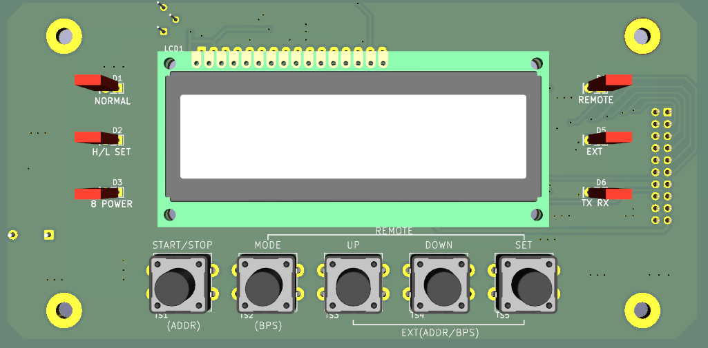

# CSF JET Multi Megasonic 사용자 운전 매뉴얼 (대체판 초안)

- 문서명: CSF JET Multi Megasonic 사용자 운전 매뉴얼
- 문서 버전: Draft v1.2
- 적용 장비: CSF JET Multi Megasonic (LCD 패널형)
- 기준 문서: 기존 HS AUP 계열 운전 철학 + 본 프로젝트 최신 사양
- 최종 수정일: 2026-05-18

## 0. 개정 이력

| 버전 | 날짜       | 변경 내용                                                                           | 작성  |
| ---- | ---------- | ----------------------------------------------------------------------------------- | ----- |
| 1.2  | 2026-05-18 | 문서-코드 정합화: 출력 범위 5.00W, 알람 해제 SET, 선택/설정 모드 중심 조작으로 정리 | Draft |
| 1.1  | 2026-05-18 | 선택모드/설정모드 2계층 UI, FREQ(CH/FREQ/L), POWER(CH/LOW/HIGH/DEF) 설정 절차 반영  | Draft |
| 0.1  | 2026-04-27 | 기본 초안 생성                                                                      | Draft |
| 0.5  | 2026-04-27 | 키 조작 복원, 통신/알람 보강                                                        | Draft |
| 0.9  | 2026-04-27 | 기존 매뉴얼 대체 수준 구조로 전면 확장                                              | Draft |
| 1.0  | 2026-05-18 | FREQENCY 편집/채널 표기를 코드와 일치화 (1CH~10CH, 400~2200kHz)                     | Draft |

## 1. 문서 목적 및 적용 범위

본 문서는 현장 작업자, 장비 셋업 담당자, 유지보수 엔지니어가 **문서만으로 장비를 설치/운전/복구**할 수 있도록 작성된 운전 매뉴얼이다.

다음 항목을 포함한다.

- 전원 투입 전 점검
- 패널 키 조작 및 운전 모드
- 출력/주파수/알람 설정
- 에러 코드 및 복구 방법
- RS-485 Modbus RTU 통신 규격 및 운용 예시
- 트러블슈팅 및 유지보수 체크리스트

## 2. 제품 개요

CSF JET Multi Megasonic은 LCD 기반 UI와 RS-485 통신을 지원하는 메가소닉 발생기이다.

핵심 특징:

- 10채널 주파수 운전 (400kHz~2.2MHz)
- 최대 출력 설정 5.00W
- 출력 설정 범위 0.10W~5.00W
- LOCAL 운전 + REMOTE 운전 + EXT(통신) 운전 지원
- 기존 매뉴얼의 조작 감각을 유지한 5버튼 UI

## 3. 주요 사양

| 항목             | 사양                                            |
| ---------------- | ----------------------------------------------- |
| 모델명           | CSF JET Multi Megasonic                         |
| 작동 주파수      | 10CH, 400kHz~2.2MHz                             |
| 최대 출력 설정   | 5.00W                                           |
| 출력 설정 범위   | 0.10W~5.00W                                     |
| 출력 제어 분해능 | 0.01W                                           |
| 표시 장치        | LCD1602 (2행 x 16문자)                          |
| 상태 표시        | 6 LED (NORMAL/H-L SET/8 POWER/REMOTE/EXT/TX-RX) |
| 통신             | RS-485 Half-Duplex, Modbus RTU                  |
| 기본 통신 속도   | 9600bps                                         |
| 운전 모드        | NORMAL / REMOTE / EXT                           |

## 4. 안전 경고 및 주의사항

### 4.1 필수 안전 경고

- 장비 접지 확인 없이 전원 인가 금지
- 출력 케이블 미결선 상태에서 고출력 장시간 운전 금지
- 센서(SENSOR) 단자 오픈 상태에서 강제 운전 금지
- 출력 이상 알람 발생 시 원인 확인 전 반복 재기동 금지

### 4.2 에러 해제 관련 주의

- 현재 메뉴 UI 기준: 선택모드에서 `SET` 1회로 알람 해제
- 안전상 SENSOR 계열 에러는 원인 제거 후 재가동을 권장

### 4.3 통신 모드 주의

- NORMAL/REMOTE 모드에서 쓰기 명령은 제한될 수 있음
- 패널 UI에서 ADDR/BPS 전용 설정 화면은 현재 구현 범위가 아님

## 5. 패널 구성 및 의미

### 5.1 버튼(5개)

| 버튼       | 기본 기능                                                     |
| ---------- | ------------------------------------------------------------- |
| START/STOP | 발진 시작/정지, FREQ 설정 화면에서 약 3초 누름 시 Auto Tuning |
| MODE       | 화면/설정 모드 전환, NORMAL 복귀 동작                         |
| UP         | 값 증가/항목 상향 이동                                        |
| DOWN       | 값 감소/항목 하향 이동                                        |
| SET        | 선택/확정/저장                                                |

### 5.2 LED(6개)

| LED     | 의미                                 |
| ------- | ------------------------------------ |
| NORMAL  | NORMAL 모드 활성                     |
| H/L SET | (예약) 알람 설정 표시 확장용         |
| 8 POWER | (예약) 8POWER 상태 표시 확장용       |
| REMOTE  | REMOTE 모드 활성 (운전 중 점멸 가능) |
| EXT     | EXT 모드 활성                        |
| TX/RX   | 통신 활동 표시                       |

### 5.3 LCD 기본 화면

표시 예:

- 1행: RUN/STOP, 모드, FREQ 채널, POWER 채널
- 2행: 선택 항목별 값/편집 정보

예시 문자열:

- RUN NOR F01 P1
- > MODE:NORMAL

## 6. 전원 투입 전 체크리스트

전원 투입 전 아래 항목을 순서대로 확인한다.

1. AC/DC 전원 규격이 장비 사양과 일치하는가?
2. 보호접지(PE)가 정확히 연결되었는가?
3. 트랜스듀서/출력 라인이 올바르게 결선되었는가?
4. SENSOR 입력이 정상 상태인가?
5. REMOTE 단자 사용 여부가 운전 계획과 일치하는가?
6. RS-485 A/B 극성이 마스터 장치와 일치하는가?
7. 주소 충돌 가능성이 없는가?

체크 완료 후 전원을 인가한다.

## 7. 전원 ON 및 모드 진입

### 7.1 기본 기동

- 전원 ON 시 기본 화면 진입
- 기본 운전 모드는 NORMAL

### 7.2 부팅 시 동시 누름 조합 (기존 매뉴얼 기준)

| 부팅 조합               | 동작             |
| ----------------------- | ---------------- |
| 전원 ON + SET+DOWN 유지 | NORMAL 강제 진입 |
| 전원 ON + SET+MODE 유지 | REMOTE 진입      |
| 전원 ON + UP+MODE 유지  | EXT 진입         |

현장에서는 장비 운전 시작 전 원하는 모드로 부팅 진입을 먼저 확정하는 것을 권장한다.

## 8. 선택모드/설정모드 운용 (코드 기준)

### 8.1 선택모드 (기본 화면)

- MODE 짧게: 선택 항목 순환 (MODE -> FREQ CH -> 8PWR)
- MODE 2초: 설정모드 진입
- START/STOP 짧게: RUN/STOP
- UP/DOWN:
  - MODE 항목: NORMAL/REMOTE/EXT 전환
  - FREQ 항목: 1~10 채널 선택 (FREQ+L 즉시 반영)
  - 8PWR 항목:
    - 정지 중: 1~8 채널 선택
    - 운전 중: 현재 채널 DEF 출력(0.01W) 증감

### 8.2 설정모드 상위

- 항목: 1.FREQ SET / 2.POWER SET
- UP/DOWN: 항목 선택
- SET: 선택 항목 편집 진입
- MODE 짧게 또는 길게: 선택모드 복귀

### 8.3 FREQ 설정

- 필드 순환: MODE 짧게 (CH -> FREQ -> L-STEP)
- CH: 1~10
- FREQ: 400~2200kHz (1kHz step)
- L-STEP: 1~16
- SET: 현재 CH의 FREQ+L 저장
- START/STOP 약 3초: Auto Tuning 실행 후 저장
- MODE 2초: 설정모드 상위 복귀

### 8.4 POWER 설정

- 필드 순환: MODE 짧게 (CH -> LOW -> HIGH -> DEF)
- CH: 1~8
- LOW: 0.10~0.95W
- HIGH: 0.20~5.00W
- DEF: 0.20~5.00W (LOW/HIGH 범위 자동 보정)
- SET: 현재 CH의 LOW/HIGH/DEF 저장
- MODE 2초: 설정모드 상위 복귀

## 9. 키 조합 요약표 (현장용)

| 구분      | 조합                          | 동작           |
| --------- | ----------------------------- | -------------- |
| 설정 진입 | 선택모드에서 MODE (2초)       | 설정모드 진입  |
| 편집 진입 | 설정모드 상위에서 SET         | 항목 편집 진입 |
| 필드 전환 | 편집 화면에서 MODE (짧게)     | 편집 필드 순환 |
| 상위/복귀 | 편집 화면에서 MODE (2초)      | 설정 상위 복귀 |
| 선택 복귀 | 설정 상위에서 MODE (짧게/2초) | 선택모드 복귀  |
| 값 저장   | 편집 화면에서 SET             | 현재 값 저장   |
| 오토튜닝  | FREQ 편집에서 START/STOP 3초  | Auto Tuning    |
| 알람 해제 | 선택모드 알람 표시 중 SET     | 현재 에러 해제 |

## 10. 주파수/출력 설정 상세

### 10.1 주파수 채널

본 장비는 10CH 운전을 지원한다. (패널 표기: 1CH~10CH)

| 채널 | 기본 주파수(kHz) | 비고      |
| ---- | ---------------- | --------- |
| 1CH  | 400              | 시작 채널 |
| 2CH  | 600              |           |
| 3CH  | 800              |           |
| 4CH  | 1000             |           |
| 5CH  | 1200             |           |
| 6CH  | 1400             |           |
| 7CH  | 1600             |           |
| 8CH  | 1800             |           |
| 9CH  | 2000             |           |
| 10CH | 2200             | 상한 채널 |

참고:

- 채널 변경 시 출력 안정화 시간을 충분히 확인한다.
- 고주파 채널(2MHz 이상)은 배선/부하 상태 영향이 크므로 단계 상승 운전을 권장한다.

### 10.2 출력 설정

- 설정 범위: 0.10W~5.00W
- 조정 단위: 0.01W
- 운전 중 설정 변경 시 출력 안정화 대기 필요

권장 운전 절차:

1. 저출력에서 시작
2. 부하 상태 확인
3. 목표 출력까지 단계 상승
4. 이상 여부(알람, 반사전력 증가) 확인

## 11. 알람/에러 코드 상세

### 11.1 에러 코드 정의

| 코드 | 명칭             | 발생 조건                          | 출력 상태 |
| ---- | ---------------- | ---------------------------------- | --------- |
| Err1 | LOW ALARM        | 출력이 LOW 임계 이하로 5초 지속    | 정지      |
| Err2 | HIGH ALARM       | 출력이 HIGH 임계 이상으로 5초 지속 | 정지      |
| Err5 | TRANSDUCER ALARM | 진동자/부하 이상 상태 5초 지속     | 정지      |
| Err6 | SETTING ERROR    | 허용 범위 밖 설정 시도             | 조건부    |
| Err7 | SENSOR OFF       | 정지 중 SENSOR 오픈 감지           | 정지      |
| Err8 | SENSOR RUN       | 운전 중 SENSOR 오픈 감지           | 정지      |

### 11.2 에러별 조치 절차

#### Err1 (LOW ALARM)

1. 출력선 결선/부하 상태 확인
2. LOW 임계값 과도 설정 여부 확인
3. 선택모드에서 SET으로 해제
4. 재기동 후 실측 출력 추적

#### Err2 (HIGH ALARM)

1. 출력 설정값과 실제 부하 상태 비교
2. HIGH 임계값 재검토
3. 선택모드에서 SET으로 해제
4. 단계 출력으로 재시험

#### Err5 (TRANSDUCER ALARM)

1. 트랜스듀서, 케이블, 커넥터 점검
2. 과출력/과주파수 운전 여부 점검
3. 원인 점검 후 SET 해제 또는 전원 재기동

#### Err7 / Err8 (SENSOR 계열)

1. 즉시 출력 정지 확인
2. SENSOR 회로 물리 점검
3. 전원 OFF
4. SENSOR 정상 확인
5. 전원 ON 후 재기동

## 12. RS-485 Modbus RTU 통신

### 12.1 물리 계층

| 항목          | 사양                    |
| ------------- | ----------------------- |
| 규격          | RS-485 Half-Duplex      |
| 배선          | A/B 2선 + GND 권장      |
| 종단 저항     | 라인 양단 120옴 권장    |
| 기본 보레이트 | 9600bps                 |
| 지원 보레이트 | 9600/19200/38400/115200 |

배선 주의:

- A/B 극성 반전 시 통신 불가
- 스타 토폴로지보다 버스 토폴로지 권장
- 케이블 쉴드와 접지 기준점 설계 일관성 유지

### 12.2 UART/프레임 설정

- 데이터 비트: 8
- 패리티: None/Even/Odd
- 스톱 비트: 패리티 조합에 따라 장치 설정 기준 적용
- 프로토콜: Modbus RTU
- CRC: CRC-16 (0xA001)

### 12.3 기능 코드

| FC   | 기능                  |
| ---- | --------------------- |
| 0x03 | Holding Register 읽기 |
| 0x06 | 단일 Register 쓰기    |
| 0x10 | 복수 Register 쓰기    |

### 12.4 예외 코드

| 코드 | 의미                 |
| ---- | -------------------- |
| 0x01 | Illegal Function     |
| 0x02 | Illegal Data Address |
| 0x03 | Illegal Data Value   |
| 0x04 | Slave Device Failure |

### 12.5 모드별 접근 정책

- NORMAL/REMOTE: 읽기 중심 (현장 정책에 따라 쓰기 제한)
- EXT: 읽기/쓰기 운용

### 12.6 기본 통신 점검 절차

1. 슬레이브 주소 확인
2. BPS/패리티 일치 확인
3. FC03으로 상태 레지스터 읽기
4. EXT 모드에서 FC06 시험 쓰기
5. 응답 CRC 및 값 반영 확인

## 13. 레지스터 맵 (운전 필수판)

### 13.1 운전 제어 그룹 (0x0000~)

| 주소   | R/W | 항목          | 단위/범위         |
| ------ | --- | ------------- | ----------------- |
| 0x0000 | R/W | RUN 제어      | 0=OFF, 1=ON       |
| 0x0001 | R/W | 출력 설정값   | x0.01W (10~1000)  |
| 0x0002 | R   | 실측 출력     | x0.01W            |
| 0x0003 | R/W | 주파수 채널   | 0~9               |
| 0x0004 | R   | 현재 주파수   | x0.1kHz           |
| 0x0005 | R   | 상태 플래그   | bit field         |
| 0x0006 | R/W | 운전 모드     | 0=NOR,1=REM,2=EXT |
| 0x0007 | R/W | 슬레이브 주소 | 1~247             |

### 13.2 알람/진단 그룹

| 주소   | R/W | 항목           | 범위        |
| ------ | --- | -------------- | ----------- |
| 0x0010 | R/W | HIGH 알람      | x0.01W      |
| 0x0011 | R/W | LOW 알람       | x0.01W      |
| 0x0012 | R   | 에러 상태      | bit field   |
| 0x0013 | W   | 에러 리셋      | 1=리셋 요청 |
| 0x0014 | R   | 출력 전압 지표 | 장치 정의   |
| 0x0015 | R   | 출력 전류      | mA          |
| 0x0016 | R   | 임피던스       | ohm         |
| 0x0017 | R   | 펌웨어 버전    | major/minor |

### 13.3 주파수 채널 테이블 그룹

- 0x0050~0x0059: 내부 채널 인덱스 0~9 주파수 테이블 (패널 표시 1CH~10CH, x0.1kHz)

운용 주의:

- 설치 현장별 공진점에 맞춰 테이블을 조정할 수 있다.
- 변경 후 시험 운전 기록을 남긴다.

## 14. 통신 프레임 예시

### 14.1 상태 읽기 (FC03)

요청 예:

- [ADDR] [03] [00 00] [00 08] [CRC_L CRC_H]

의미:

- 0x0000부터 8개 레지스터 읽기

### 14.2 출력 설정 (FC06)

요청 예:

- [ADDR] [06] [00 01] [00 64] [CRC_L CRC_H]

의미:

- 출력 설정값 0x0064 = 100 = 1.00W

### 14.3 채널 설정 (FC06)

요청 예:

- [ADDR] [06] [00 03] [00 09] [CRC_L CRC_H]

의미:

- 내부 인덱스 9 선택 (패널 표시 10CH)

## 15. 현장 운전 시나리오

### 15.1 시나리오 A: 로컬 기본 운전

1. NORMAL 모드 진입
2. 출력값 0.30W 설정
3. START/STOP으로 운전 시작
4. 실측값 안정 확인
5. 필요 시 출력 단계 상승

### 15.2 시나리오 B: REMOTE 접점 운전

1. SET+MODE 부팅으로 REMOTE 진입
2. 외부 접점 ON으로 출력 시작
3. 외부 접점 OFF로 정지
4. 알람 발생 시 현장 점검 후 복구

### 15.3 시나리오 C: EXT 통신 운전

1. UP+MODE 부팅으로 EXT 진입
2. 마스터에서 FC03으로 상태 확인
3. 필요 시 FC06/FC10으로 출력/채널 제어
4. 응답 CRC와 값 반영 상태 확인

## 16. 트러블슈팅

| 증상                 | 원인 후보                         | 조치                          |
| -------------------- | --------------------------------- | ----------------------------- |
| 통신 응답 없음       | A/B 반전, 주소 불일치, BPS 불일치 | 배선/주소/속도 재확인         |
| 출력 시작 직후 정지  | SENSOR 오픈, 알람 임계 과민       | SENSOR/알람값 점검            |
| 출력값이 목표와 다름 | 부하 변동, 튜닝 필요              | 저출력 재튜닝 후 단계 상승    |
| Err7 반복            | SENSOR 배선 불안정                | 센서 회로 물리 점검/교체      |
| REMOTE 동작 불안정   | 접점 바운스, 간격 미준수          | 접점 품질 개선, 3초 간격 운용 |

## 17. 유지보수 점검 기준

### 17.1 일일 점검

- 케이블/커넥터 이탈 여부
- LCD/LED 상태 표시 정상 여부
- 이상 알람 발생 이력 확인

### 17.2 주간 점검

- 출력 재현성 확인
- 통신 응답 품질 확인
- 주소 충돌 여부 확인

### 17.3 월간 점검

- 트랜스듀서/배선 절연 상태 점검
- 알람 임계값 재검토
- 펌웨어 버전/설정 백업

## 18. 판넬 인쇄/라벨 권장안

### 18.1 전면 실크

- START/STOP
- MODE
- UP
- DOWN
- SET

### 18.2 후면 라벨(필수 권장)

- NORMAL: PWR ON + SET+DOWN
- REMOTE: PWR ON + SET+MODE
- EXT: PWR ON + UP+MODE
- SETTING ENTRY: MODE LONG(2s)
- ERROR RESET: SET (선택모드)

## 19. 출하/설치 체크리스트

### 19.1 출하 전

- [ ] 기본 부팅, LCD 표시 확인
- [ ] NORMAL/REMOTE/EXT 진입 조합 확인
- [ ] START/STOP 동작 확인
- [ ] 알람 해제 동작 확인 (SET 키)
- [ ] RS-485 기본 통신 확인 (FC03)

### 19.2 설치 후

- [ ] 현장 주소 할당 완료
- [ ] BPS/패리티 일치 확인
- [ ] 출력 저전력 시험 완료
- [ ] 보호 동작(Err7/Err8) 확인

## 20. 부록 A - 에러 코드 빠른 참조 카드

| 코드 | 의미       | 즉시 조치                        |
| ---- | ---------- | -------------------------------- |
| Err1 | LOW ALARM  | 출력/부하 확인 -> SET 해제       |
| Err2 | HIGH ALARM | 임계값/출력 확인 -> SET 해제     |
| Err5 | TRANSDUCER | 원인 점검 -> SET 해제/재기동     |
| Err6 | SETTING    | 값 범위 재입력                   |
| Err7 | SENSOR OFF | 전원 OFF -> 센서 확인 -> 전원 ON |
| Err8 | SENSOR RUN | 전원 OFF -> 센서 확인 -> 전원 ON |

## 21. 부록 B - Modbus 운영 빠른 참조

| 항목             | 값                                                 |
| ---------------- | -------------------------------------------------- |
| 물리 계층        | RS-485 Half-Duplex                                 |
| 기본 속도        | 9600bps                                            |
| 기능 코드        | 0x03 / 0x06 / 0x10                                 |
| CRC              | CRC-16 (0xA001)                                    |
| 권장 테스트 순서 | FC03 상태 읽기 -> FC06 단일 쓰기 -> FC10 다중 쓰기 |

---

본 문서는 기존 매뉴얼을 대체하기 위한 운전/통신 통합 초안이다.
펌웨어 릴리즈 후보(RC)에서 최종 레지스터 범위 및 채널 테이블이 확정되면 v1.0으로 발행한다.
